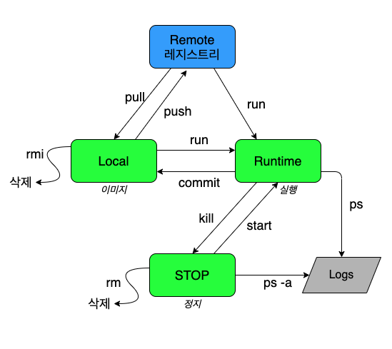

## 개념


#### 이미지
- 운영체제와 소프트웨어를 담고있는 컨테이너 실행 이전의 상태.
- 각 이미지는 '리포지터리:태그'로 식별된다.
> 태그란? imagename:tag형태로 되어있는데 통상적으로 tag는 Architect나 버전을 의미한다.
```
컨테이너이미지에는 절대 커널이 포함될수없다.
하지만 컨테이너 이미지에도 OS 이미지가 있다(Centos, Fedora, ubuntu ...)
OS image는 base image라고도 하고 다른 이미지를 생성하기 위한 용도로 사용한다.
lib, Binary만 포함 시킨다.
```
#### 리포지토리 (레지스트리)
- 이미지 보관소
- 리포지토리의 이름에 버전 등을 의미하는 태그를 붙여 각각의 이미지를 구별하여 보관 가능
- 태그를 생략하면 최신을 의미하는 latest가 사용
#### docker hello-world 실행 순서
1. 도커 클라이언트가 도커 데몬접속
2. 도커 데몬이 도커 허브에서 이미지를 pull함
3. 도커 데몬에서 새 컨테이너 생성후 해당 서비스의 결과를 실행
4. 도커 데몬은 해당 출력을 도커 클라이언트의 표준 출력으로 전송

#### 상태
- 이미지 : 컨테이너의 모형이 되는 것으로 실행되기 전의 상태
- 실행 : 컨테이너 위에서 프로세스가 실행중인 상태
- 정지 : 프로세스의 종료 코드, 로그가 보존 된채 정지한 상태




### docker command
```
docker cp
도커의 내부에 있는 파일에 복사할수있다.


docker rm -f `docker ps -aq`
# 모든 Container(실행, 종료) 전부 삭제


docker  image inspect ubuntu | grep -A 3

# inspect 결과 볼때 원하는 결과만 볼수있게
docker image inspect [imagename] -f {{.RootFS.Layers}}


```


### docker Storage
컨테이너에 생성되는 모든 파일은 컨테이너에 저장됨.<br>
컨테이너 종료시 함께 삭제 되는 런타임 데이터인데, 영구적으로 저장하려면 반드시 볼륨을 사용. <br>
-v 옵션 사용
- bind mount
```
호스트의 특정 디렉토리와 컨테이너의 디렉토리 연결
도커에 의해 관리 되지 않는다.
설정파일,소스코드 같은 파일을 공유, 미리 제공하려는 목적

```
- volume
```
도커에 의해 관리되는 스토리지
서비스가 디스크에 데이터를 저장
빈 디스크를 제공 -> mysql의 저장 장소

컨테이너에서 호스트 구성을 분리


mountpoint : hostdir
```

### docker Network
kuvernetes에서는 다른 네트워크를 사용한다.
- bridge
```
L2 네트워크를 제공하기 위한 드라이버

스위칭을 하는 기능이 소프트웨어로 구성됨 (= 하드웨어로 구성,스위치와 같다.)


```
- host
```
host 네트워크를 공유하게됨.
```

- none
```
컨테이너만 있고, 아무 네트워크도 없다.
```
- prot forwarding
```
컨테이너의 외부 노출

docker run -p  8080:80
# 호스트의 8080포트로 접속시 컨테이너의 80포트로 전달
```

- Link
```
컨테이너간 통신시 같은 bridge 네트워크이용
컨테이너 이름을 사용하여 통신을 할수있는 것
-- link [Container]
/etc/hosts 파일에 생성됨

```


## 컨테이너 개발
### 레이어 개념
```
이미지 생성시에 다른 이미지를 다운 받을 때 같이 받아진 레이어를 참조해서 다운 받아진다. 레이어는 공유된다.

Storage Driver: overlay2

```
###  docker cmd 변경
```
직접 만든 이미지를 commit 했을 경우 COMMAND가 bash로 고정되어있다.
cmd를 바꿔줄 필요가 있음


docker commit --change='CMD apachectl -D FORGROUND' imagename:tag
```


### docker export / import
```
docker export 컨테이너의 파일 시스템을 추출하여 아카이브 파일로 생성
docker import 추출된 아카이브파일을 이미지화
```
### 이미지 빌드 흐름
```
1. 디렉토리를 준비하여 이미지에 포함 시킬 파일 모음
2. Dockerfile 작성
3. Container에서 실행할 앱 코드 작성, 유닛 테스트 실행
4. 이미지 빌드
5. 컨테이너 실행 후 동작 확인
```
#### dockerfile
```
FROM : 베이스 이미지, 필수
RUN : 생성하면서 실행할 명령어, 순서대로 지정해줘야함
CMD : 실행항 서비스 지정
ENV : 환경변수
EXPOSE : 노출시킬 포트 지정
VOLUME : -v 안해도 자동으로 마운트 됨
ENTRYPOINT

RUN, CMD, ENTRYPOINT exec와 shell 형식이 있는데 보통 exec형식으로 사용한다.

shell 형식은 shell위에서 실행되는 거기때문임. (환경 변수를 사용해야하는 경우 shell형식 지정)

=> shell의 기능이 반드시 필요한 경우가 아니면 exec 형식을 사용하자.


1. CMD
CMD apachectl -D FORGROUND

2. ENTRYPOINT
ENTRYPOINT apachectl -D FORGROUND

3. CMD,ENTRYPOINT => 각각 실행되는 부분이 아니라 ENTRYPOINT 실행 후 arg로 CMD가 실행
ENTRYPOINT apachectl
CMD -D FORGROUND
```
```
ADD를 통해 파일 뿐만 아니라 디렉토리 단위도 받을수있다
FROM ubuntu:20.04
ENV DEBIAN_FRONTEND nointeractive
RUN apt update && apt install -y apache2
ENTRYPOINT ["apachectl"]
CMD ["-D", "FOREGROUND"]
EXPOSE 8080/tcp
ADD conf/ /etc/apache2/  <==
COPY html/ /var/www/html/ <==


docker build시에 추가하지 않을 파일을 지정할수있다.
.dockerignore 파일 생성함 (.gitignore와 동일)

```

### dnagling images
```
이미지 생성 과정에서 에러가 발생되면 쓸모 없는 none:none 이미지가 생성 된다.

-> docker image prune
```

### ubuntu apache2 포트 공개
```
Port
     Dockerfile
        EXPOSE  ?
    ports.conf
        LISTEN ?


dockerfile에서 EXPOSE로 지정한 포트 번호와 실제 ports.conf에 있는 apache2 포트 번호는 어떤 관계인지?

EXPOSE는 단순한 포트 정보를 제공할뿐이지 동작하지는 않는다
docker run -p 옵션으로 포트를 지정해야한다.

EXPOSE : 사용자에게 보이는 포트 정보 (실제 동작 x)
ports.conf : 실제 서비스에 대한 포트

```
### docker layer
```
layer는 파일이다.  (파일의 추가가 있을때마다 layer가 추가됨.)
dockerfile의 앞에 command 갯수만큼 이미지 layer가 쌓인다.
(RUN, CMD, ADD, COPY)
```

#### Dockerfile 작성 모범 사례
[도커 레퍼런스](https://docs.docker.com/engine/reference/builder/)<br>
[도커파일 모범사례](https://docs.docker.com/develop/develop-images/dockerfile_best-practices/)
