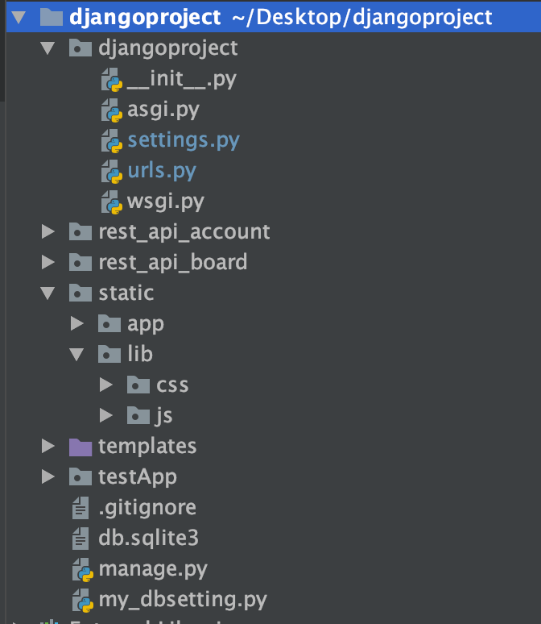
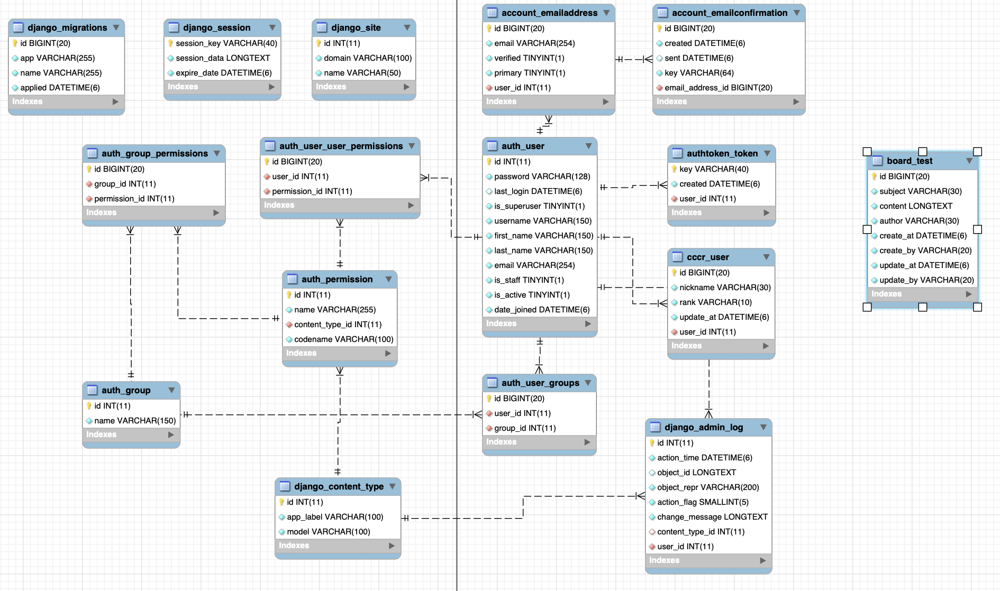
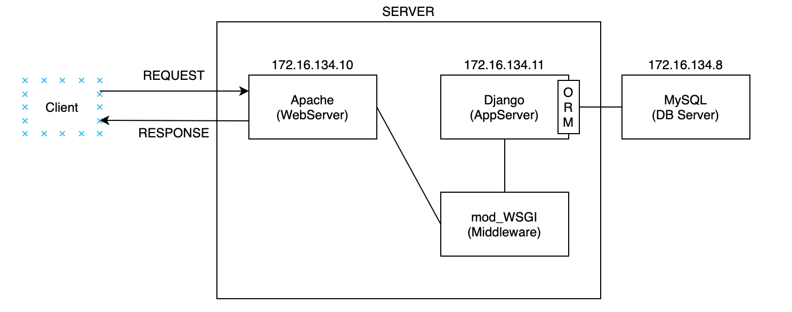
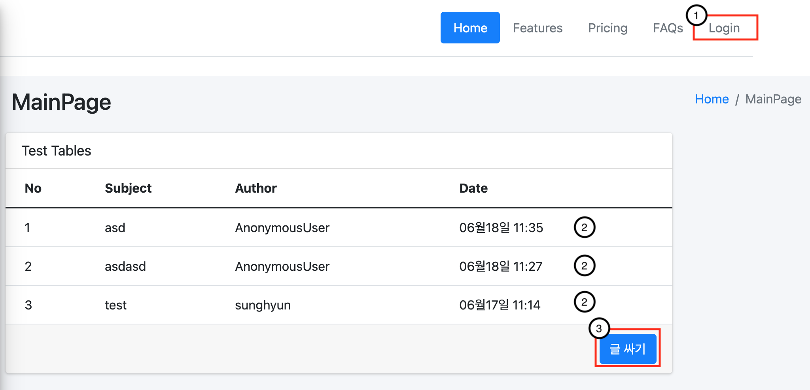
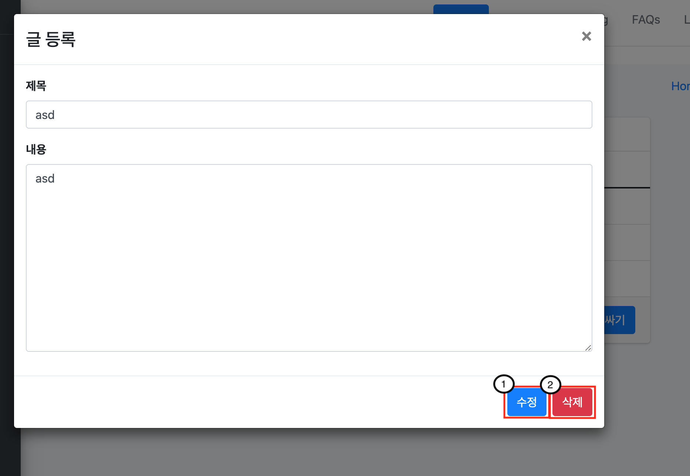
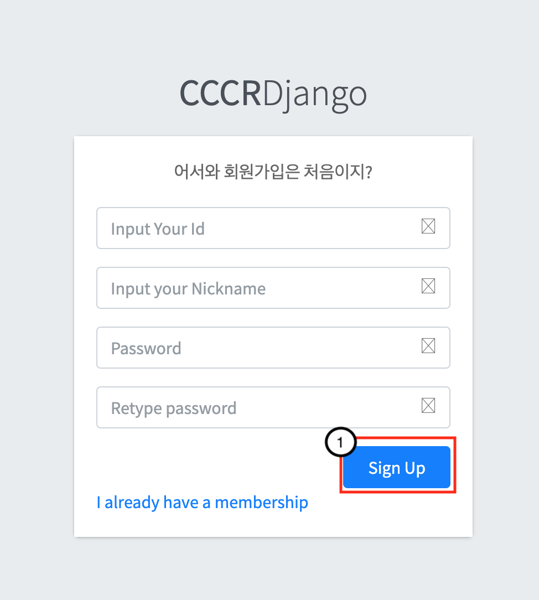
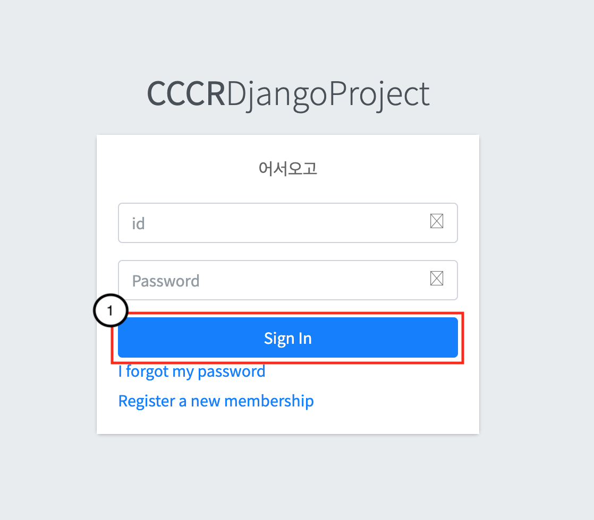
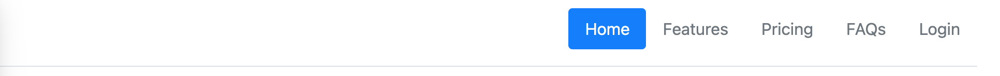
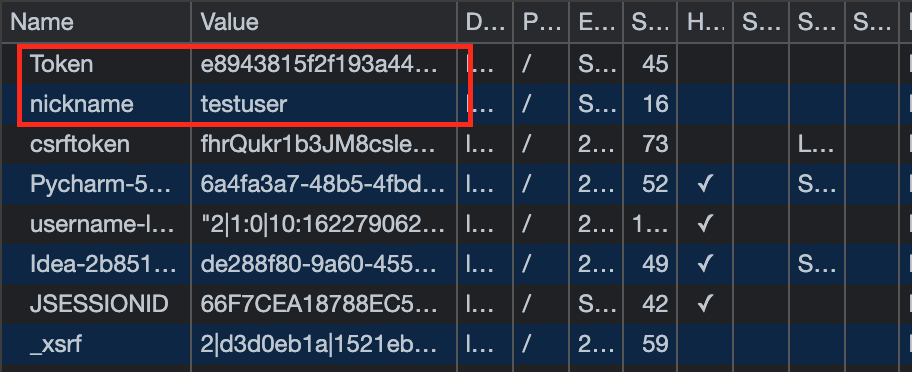

# 1. 프로젝트 개요
1. python-django를 처음 배우면서 기존에 있던 웹 지식을 그대로 적용하여 간단한 웹페이지를 제작.
2. front-end와 back-end를 완전히 분리하여 구현하는게 목적.
3. 가상 머신(Centos 7)3대를 사용하여 Database-server, djnago-server(AppServer), Apache(Web server)의 분리를 하고자 함.
4. back-end에서 restApi를 직접 만들어 보고 front-end에서 URL로만 접근하여 데이터를 송수신 할수있도록 하는게 목적.

**front-end는 front-end 기능 개발에 충실하고,<br>**
**back-end는 back-end 기능 개발에 충실하자.**

[RPOJECT GITHUB ADDRESS](https://github.com/shkimm5189/djangoproject)

# 2. 프로젝트 진행 환경
## 기술 스택
### OS
- Cenos 7

### Server-Side
- **Python 3.8.10**
- **Django 3.2.3**
  - djangorestframework
  - django-rest-auth
  - django-allauth
- **MYSQL 5.7**
- MySQL Workbench
- Apache 2.4
- mod_wsgi

### Client-Side
- Bootstrap
- Adminlte
- jQeury 3.6
- AJAX

### 버전/소스 관리
- Git / Github

# 3. 프로젝트 구조
## Django 파일 구조



|directory|Role|
|--|--|
|djangoproject| default 세팅 저장|
|rest_api_board| 게시판 CRUD지원하는 rest Api 제공|
|rest_api_account| 회원가입 및 로그인(token 발행, 쿠키저장) restApi 제공|
|static| - app : 직접 만든 js 파일  <br>-lib : css 및 js 파일 |
|templates| html 파일 |
|testApp| main page|
## Databse 구조



## 배포 인프라 구조


# 4. 프로젝트 기능
## SITE MAP
```
/testApp/           : mainpage 현재 게시물 모두 확인 (상세 정보는 modal로 확인가능)
        / register  : 게시물 등록 페이지
        / login     : 로그인 페이지
        / signup    : 회원가입 페이지
```
## 게시판 REST API
- django rest framework를 이용하여 rest 서버 CRUD 구축

**Content-type : Json**
|Method|Url|Role|
|--|--|--|
|GET|게시물 모두 조회 : /api/boards/<br>특정 게시물 조회 : /api/board/{id}|
|POST|/api/boards/|게시물 등록|
|PUT|/api/boards/{id}|게시물 수정|
|DELETE|/api/boards/{id}|게시물 삭제|

## 유저 REST API
- 회원 가입 및 로그인 구현 방식 : django에서 제공하는 user를 받아서 custom user를 생성하고 restframework에서 제공하는 토큰과 연동하여 회원가입시 토큰을 Database에 저장하고 로그인 시에 database에 저장된 토큰과 유저의 정보를 비교하여 토큰값으로 유저의 정보를 조회한다.
필요한 값은 토큰값과 함께 쿠키에 저장한다.

|Method|Url|Role|
|--|--|--|
|POST|api/auth/token/signup|회원 등록(token 생성)|
|POST|api/auth/token/login|로그인 (쿠키 등록)|
|GET|api/auth/token/logout|로그아웃(쿠키 삭제)|

## 관리자 페이지
- Django에서 지원하는 기본 admin 페이지를 사용했다.
- 관리자 페이지를 제공하기때문에 개발 시간이 많이 단축되었다.
# 5. 구현 코드
## 게시판 구현 중 일부
```python
# models.py
class MyBoard(models.Model):

    subject = models.CharField(max_length=30, null=False)
    content = models.TextField(max_length=300, null=False)
    author = models.CharField(max_length=30, null=False)
    create_at = models.DateTimeField(auto_now_add=True, null=False)
    create_by = models.CharField(max_length=20, null=False)
    update_at = models.DateTimeField(auto_now=True)
    update_by = models.CharField(max_length=20, null=False)

    class Meta:
        # 테이블 최신순 조회
        ordering = ['-create_at']
        db_table = "board_test"

    def __str__(self):
        return self.subject
```
```python
# serializers.py
class BoardSerializer(serializers.ModelSerializer):
    class Meta:
        model = MyBoard
        fields = ('id', 'subject', 'create_by', 'create_at', 'content')
```
```python
# views.py 중 GET Method 구현
class BoardView(APIView):
    """
    GET /api/boards/
        /api/boards/{id}
    """
    def get(self, req, **kwargs):
        boardId = kwargs.get('idx')
        if boardId is None:
            boardQueryset = MyBoard.objects.all()
            boardQuerysetSerializer = BoardSerializer(boardQueryset, many=True)
            return Response(boardQuerysetSerializer.data, status=status.HTTP_200_OK)
        else:
            boardSrializer = BoardSerializer(MyBoard.objects.get(id=boardId))
            return Response(boardSrializer.data, status=status.HTTP_200_OK)
```
> CBV 방식으로 작성 했으며 APIView를 상속 받아 CRUD를 구현하였다.
## 로그인 구현 중 일부
```python
views.py
class SignupView(APIView):
    def post(self, request):
        user = User.objects.create_user(username=request.data['id'], password=request.data['password'])
        profile = models.Profiles(user=user, nickname=request.data['nickname'])
        user.save()
        profile.save()
        # user의 값으로 새로운 토큰을 발행하여 키값을 리턴
        token = Token.objects.create(user=user)
        return Response({"Token": token.key})


class LoginView(APIView):
    def post(self, request):
        user = authenticate(username=request.data['id'], password=request.data['password'])
        #기존의 유저가 있다면 실행
        if user is not None:
            # 요청 받은 값과 일치 하는 토큰 값을 가져옴
            token = Token.objects.get(user=user)
            pro = Profiles.objects.filter(user=user).values()
            #
            # 로그인 유지를 위한 토큰 값과 해당 닉네임을 쿠키에 저장
            response = Response()
            response.set_cookie(key="Token", value=token.key)
            response.set_cookie(key="nickname", value=pro[0].get('nickname'))
            response.data = {
                "Token": token.key,
                "nickname": pro[0].get('nickname'),
            }
            return response
        else:
            return Response("login error", status.HTTP_401_UNAUTHORIZED)
```
## Apache-mod_wsgi
```python
# WSGI.py
import os
import sys
from django.core.wsgi import get_wsgi_application
path = '/root/djangoproject'
if path not in sys.path:
        sys.path.append(path)
os.environ.setdefault('DJANGO_SETTINGS_MODULE', 'djangoproject.settings')
application = get_wsgi_application()
```
# 6. 동작 화면
- testApp/


|No|Role|
|--|--|
|1| login page로 이동|
|2| 각 게시물에 대한 modal을 띄움|
|3| 글 등록 페이지로 이동|
- testApp/


|No|Role|
|--|--|
|1| 해당 게시물 변경 요청 및 modal 종료|
|2| 해당 게시물 삭제 요청 및 modla 종료|

- testApp/ register


|No|Role|
|--|--|
|1| 해당 게시물 등록 요청 및 메인페이지로 이동|

- testApp/ signup


|No|Role|
|--|--|
|1| user 생성 및 user에대한 토큰 생성 후 main page이동|

- testApp/ login


|No|Role|
|--|--|
|1| 토큰 값, 닉네임 쿠키 등록 및 로그인 |

- 로그인시 쿠키값 / 변경사항



```
로그인 시 헤더에 부분을 "login"을 logout으로 바꿈.
cookie에 해당 로그인 토큰값, 닉네임을 저장
-> 로그인 상태에서 게시물 작성 시, 작성자에 닉네임으로 자동 표시
로그인 상태에서 로그인 페이지로 다시 이동할경우, 로그인되었다는 메세지 출력후 다시 메인페이지로 이동
```

# 7. 공부한 내용들
#### ORM 사용의 장단점
```
장점
1. 동일한 목적을 같는 쿼리문도 개발자마다 다를수있기때문에 통일성이 깨질수있다.
2. 개발자가 쿼리문을 잘못 작성하게 되면 시스템의 성능이 저하될수있다.
3. DB를 변경하면 특정 DB에 의존하는 모든것을 수정 해야 하므로 유지보수가 어려울수있다.
```
> 개인 생각 : ORM은 개념 자체가 어렵고 러닝커브가 높기 떄문에 이해가 잘된 상태에서 시스템에 적용해야 한다고 생각한다. 성능적 측면에서는 sql을 그냥 타이핑 해넣는게 나을수있기때문이다. N+1문제나 orm을 적용했을 때 나타나는 성능적 문제를 충분히 고려해야한다고 생각한다.

#### 로그인 구현
- 로그인 기능을 직접 구현 해보면서 로그인정보를 어디에 저장하면 좋을지 고민해보았다.
```
인증과 인가는 기본적으로 구현해야하는 기능으로 로그인이 대표적이다.
쿠키/세션을 이용하거나 토큰을 이용하는 방법이 있다.
 여기서 유저마다 토큰을 발행하는 식으로 구현을 했는데 토큰 값을 어디에 저장해서 운영해야 하는지 많은 생각을 하게되었다.

결론적으로 보안이 크게 상관 없다면 웹스토리지에 저장해도 된다.
 하지만 웹 스토리지에 저장된 값은 javascript로 언제든지 접근 할수있어 XSS공격에 취약 할수있다.

하지만 쿠키에 저장하면 HttpOnly 속성을 사용하여 javascript로 접근을 막을수있다.
따라서, 보안적 측면에서는 쿠키에 저장하는것이 좀더 나을수있다.
```


# 8. 참고 자료
- 책
  - 점프 투 장고
- 사이트
  - [Django 공식문서](https://docs.djangoproject.com/ko/3.2/)
  - [Django restframework 공식문서](https://www.django-rest-framework.org/)
  - [Django rest auth 공식문서](https://django-rest-auth.readthedocs.io/en/latest/)
  - [jQeury 공식문서](https://api.jquery.com/)
